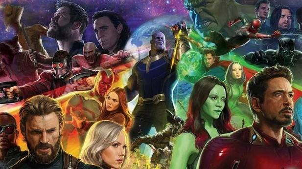

# Los Vengadores Funcionales
## Ejercicio integrador tipo parcial

**Las películas son siempre fuente de inspiración, y cuando armamos ejercicios, pensamos en las cosas que están pasando en la actualidad o las novedades. En este caso, qué mejor que la última película de los superhéroes.**

*Cuando Tony Stark intenta impulsar un programa con el objetivo de mantener la paz, las cosas comienzan a complicarse y los héroes más poderosos de la Tierra deben involucrarse. Capitán América, Thor, El Increíble Hulk, Viuda Negra, Ojo de Halcón, y Iron Man, se verán ante la prueba definitiva cuando el destino del planeta se ponga en juego. Cuando el villano Ultron emerge, le corresponderá a Los Vengadores detener sus terribles planes, a través de una épica y única aventura.*

### 1. Conociendo a Los Vengadores

Sabemos que cualquier personaje de la película, tanto un superhéroe como un villano, puede ser representado por la siguiente data:

`data Personaje = UnPersonaje {nombre::String, ataqueFavorito::Personaje->Personaje, elementos::[String], energia::Int}`

De cada uno se conoce su nombre artístico, un ataque que sabe hacer, el conjunto de sus posesiones y su energía.
~~~
hulk = UnPersonaje "hulk" superFuerza ["pantalones"] 90
thor = UnPersonaje "thor" (relampagos 50) ["mjolnir"] 100
viuda = UnPersonaje "viuda negra" artesMarciales [] 90
capitan = UnPersonaje "capitán américa" arrojarEscudo ["escudo"] 80
halcon = UnPersonaje "ojo de halcón" arqueria ["arco", "flechas"] 70
vision = UnPersonaje "vision" (proyectarRayos 5) ["gema del infinito"] 100
ironMan = UnPersonaje "iron man" (ironia (relampagos (-50))) ["armadura", "jarvis", "plata"] 60
ultron = UnPersonaje "robot ultron"  corromperTecnologia [] 100 
~~~

**Se pide:**
* Saber si un personaje es un robot. Esto es si su nombre comienza con “robot”
* Saber si un personaje dado posee un elemento determinado.
* Conocer la potencia de un personaje, que se calcula como la energía por la cantidad de posesiones. 

### 2. Ataques 

Implementar todo lo necesario para hacer que un personaje se enfrente con otro, incluyendo los ataques correspondientes, de la siguiente manera:
* El atacante ataca inicialmente a la víctima con su ataque favorito.
* La víctima contraataca con su ataque correspondiente.
* Gana quien termine con mayor energía. 

Al enfrentarse dos personajes se obtiene si es cierto que el atacante ganó el enfrentamiento, tal como haya quedado luego de la pelea.
Los ataques pueden ser, por ejemplo: 
* Super Fuerza: Deja inconsciente a su oponente, es decir, pone su energía en cero.
* Relámpagos: Le quita al enemigo una cierta cantidad de energía.
* Arqueria: Si el enemigo no tiene escudo entre sus posesiones, queda inconsciente.
* Proyectar Rayos: Es como hacer relampagos, pero con más luz.
* Arrojar Escudo: Hace que el enemigo pierda todas sus posesiones.
* Artes Marciales: Hace inofensivo al ataque enemigo. Es decir que cuando la víctima contraataque, no afecta al otro personaje. (pista: función identidad) 
* Ironia: Hace que el ataque de la víctima se transforme en el efecto benéfico que se indica (para cuando luego la víctima haga su ataque).
* CorromperTecnología: (según la propia creatividad)

### 3. Batalla final

Tarde o temprano los Vengadores deberán enfrentarse al poderoso Ultrón y a todo su ejército de robots.

Enfrentar a los Avengers con el ejército de Ultron, siendo las reglas:

El primer personaje del ejército atacante se enfrenta con el primero del otro, el segundo con el segundo, y así sucesivamente. Los restantes personajes del ejército más numeroso... miran.  

Ejemplo: Thor y el Capitán América se enfrenta con 3 robots. Thor pelea con el primer robot, Capitán América con el segundo, y con el tercer robot no pasa nada.

A partir de todos los personajes ganadores se obtiene al ejército ganador: aquel con ganó la mayoría de los enfrentamientos individuales, sin contar a los que no se enfrentaron. En caso de empate, gana el ejército atacado.

Adicionalmente, cualquier batalla se resuelve de inmediato si en alguno de los dos equipos alguien posee una gema del infinito y el otro equipo no. El ejército que lleva la gema será el ganador.

* ¿Qué sucede si Ultron arma un ejército infinito de robots: llamados “robot 1”, “robot 2”, etc., con energía 100, cuyo ataque favorito es proyectar rayos, y no llevan elementos? Mostrar ejemplos de cómo armar al ejército infinito e invocar a la función. En caso que se obtenga una respuesta, mostrarla; en caso contrario, explicar qué sucede y por qué. Si puede suceder una cosa o la otra según qué ejemplo se utilice, explicarlo adecuadamente. 

